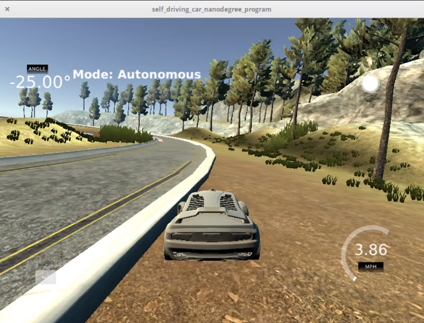
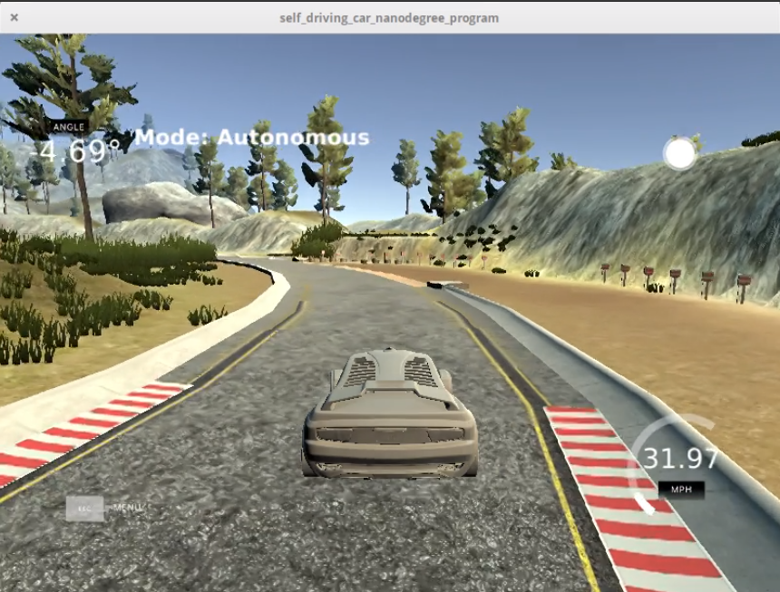
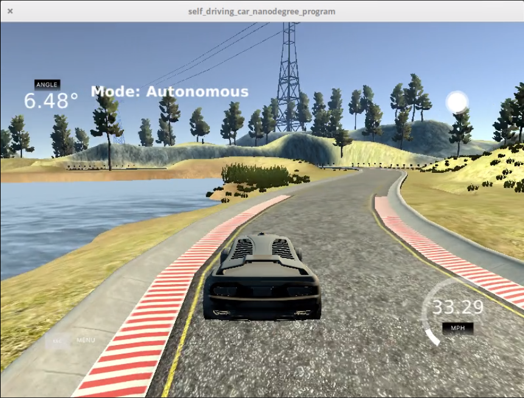
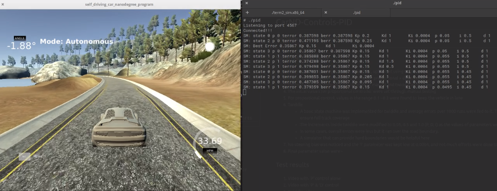

# CarND-Controls-PID
Self-Driving Car Engineer Nanodegree Program

---
## Solution Overview
1. Follow the methodology of a PID controller, optimized using twiddle
2. The parameters were optimized in the order proportional > differential > integral
3. Optimization was done by a combination of manual and twiddle algorithms.
4. The initial values for proportional controller were set through manual testing
5. For proportional control, values in the range 0.1 - 0.3 were found to keep the vehicle in lane
6. Twiddle
    *  A basic state machine was implemented for twiddle and average errors over 1000 runs were fed to it. This was to ensure full track coverage
    * The increments inside twiddle were modified to 0.05, 0.5 and 1.0 (P, D, I) as the values of parameters were small
    * In some cases, overall errors were less but it ran over the road boundary. 
    * A simulator that can provide hard boundaries would be helpful here
  7. No steering bias was noticed and the 'I' parameter was kept low at 0.0004, and not much efforts were done to tune it.
  7. Final parameter value were - 0.2, 0.0004, 1.0 (P, I, D)
## Test results
1. Video with 'P' control 

2. Video with 'P' & 'D' control

3. Video wtih 'P', 'D' & 'I' control

4. Twiddle video

## Reflection
1. The inspection was still visual as two or three edge cases were not caught in the overall error
2. Minimization of steering angle changes, and maximization of speed can also be considerations
