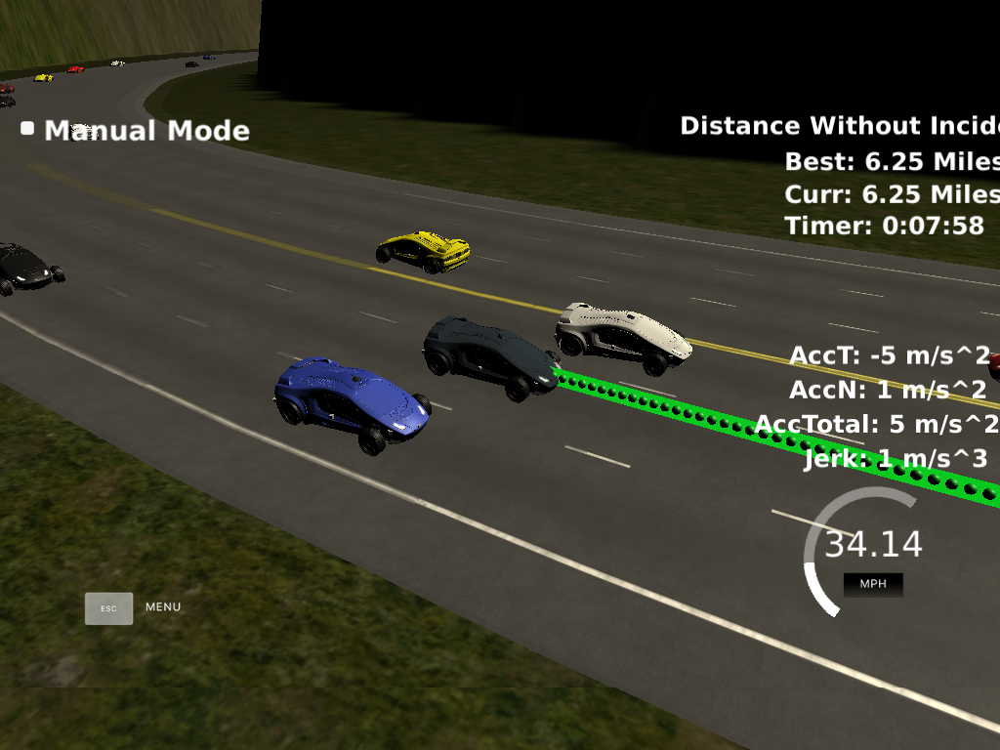
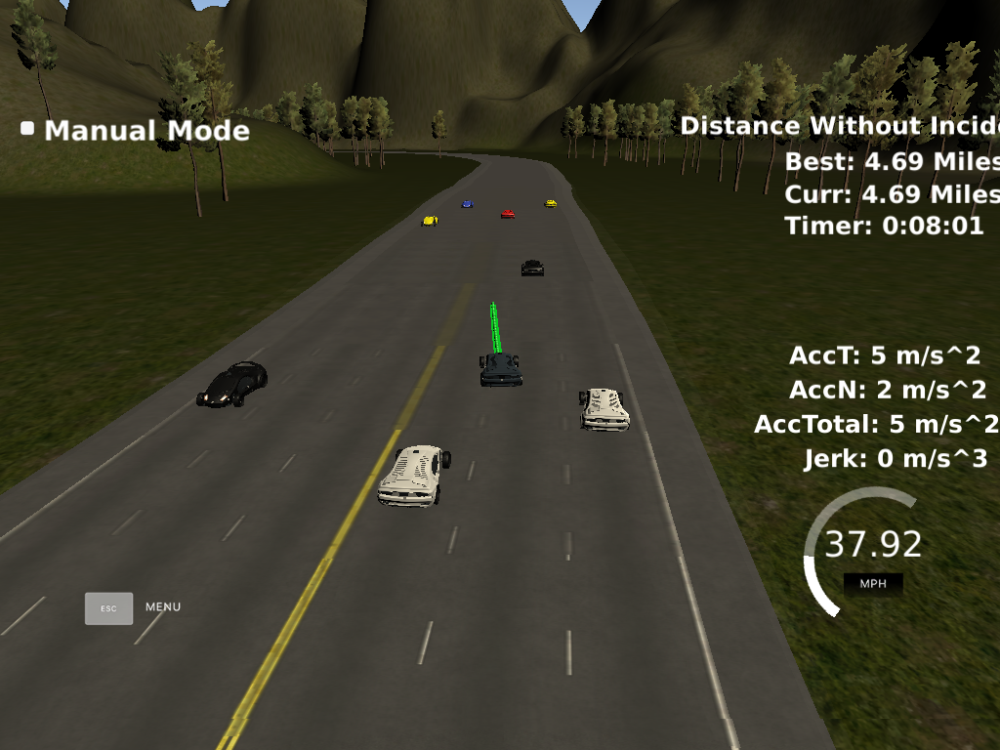

# CarND-Path-Planning-Project
Self-Driving Car Engineer Nanodegree Program

### Environment

### Solution overview
1. Obstacle detection
    * Identify the nearest obstacles in all lanes
    * In non-ego lanes, ignore obstacles beyond a certain distance both in front as well as rear. Distance was chosen based on the max distance covered by ego vehicle, speed of the non-ego vehicle, with some buffer found during testing. This is kept at 50 mph front of vehicle and 25mph towards rear.
    * In ego lane, ignore obstacles behind the ego vehicle
    * In case of multiple obstacles, identify the nearest ones
2. Target Lane identification & speed determination
    * If the distance to the vehicle in front of ego vehicle reduces, reduce speed. Else increase. Both are subject to boundary values
    * If the speed reduces below 40mph, look at adjacent free lanes. If found, reduce speed further and switch. Left lane is preferred.
    * Lane change is allowed only if 
        * Another lane change is not in progress
        * Sufficient buffer distances - 50 mph front of vehicle and 25mph in rear
        * Ego vehicle is not executing a sharp turn
3. Trajectory parameter generation
    * Trajectory is determined using Frenet co-ordinates using ego vehicle co-ordinate system
    * Previous (Estimated or real) path is used to smooth out the trajectory
    * Waypoints are used with 's' co-ordinates, and getXY() functions are used to generate the (x,y) points
    * Regular trajectory waypoints use 30m, 60m, and 90m. Lane switch trajectories 40m, 70m, 100m to smoothen out. 
4. Trajectiry generation
    * Trajectories are generated with at 0.02 secs intervals using the vehicle speed 
    * They are transformed to the map co-ordinates
    * One iteration collects waypoints for 1 second

### Test results
1. Make runs without any warnings - verified in ubuntu 
2. There is more than 1 test case in the simulator. No collisions or errors were reported in either

### Reflection
1. Better architecture to include state machines, cost functions and modularity
2. List of waypoints provided could have been used, but the path generated was smooth enough without them. 
1.  During lane switch, preference can be given based on speed & distance of the nearest non-ego vehicles in adjacent lanes
3. Lanes beyond adjacent lanes can also be considered
4. Some jerks are noticed during lane switch on curved roads

